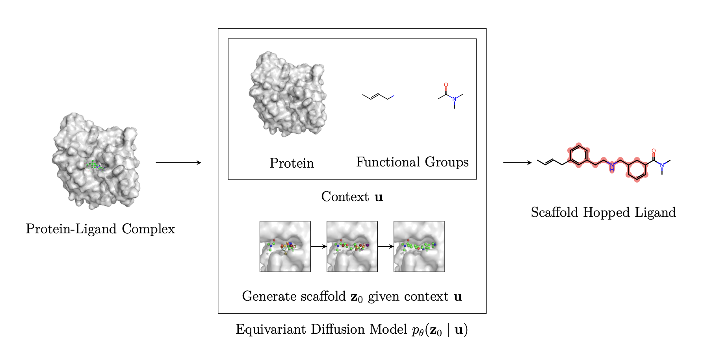

# DiffHopp: A Graph Diffusion Model for Novel Drug Design via Scaffold Hopping


Official implementation of "DiffHopp: A Graph Diffusion Model for Novel Drug Design via Scaffold Hopping". 



## Overview

The majority of the code can be found in the module `diffusion_hopping`, which is broken into three parts:

1. `data` contains the preprocessing pipeline, dataset implementations and necessary abstractions  
2. `model` contains the diffusion model as well as the two estimators, EGNN and GVP-based.
3.  `analysis` contains metrics and evaluation code as well as the necessary postprocessing.

At the root level, the repository contains a set of driver scripts that can be used to create datasets, start and resume training runs and to evaluate resulting models.

It should be noted that the codebase is significantly overengineered as it had to fulfill certain requirements as part of a dissertation.
## Installation

The conda environment can be found in `environment.yml`. To install the environment, run

```bash
conda env create -f environment.yml
```

The code furthermore assumes that `reduce` and `qvina2.1` are installed and available in the `PATH`.

The QVina binary can be found on [https://qvina.github.io](https://qvina.github.io).  
`reduce` can be installed from its GitHub repository [https://github.com/rlabduke/reduce](https://github.com/rlabduke/reduce).

### Optional Environment for evaluation

To conduct the evaluation, a second environment is needed to preprocess the files for docking. To install this optional environment, run

```bash
conda create -n mgltools -c bioconda mgltools
```

## Usage

### Scaffold Hopping
To use DiffHopp to generate novel molecules, follow these steps:

First, activate the environment and ensure that your current working directory is the root of the repository.

```bash
conda activate diffusion_hopping
pwd # should be the root of the repository
```

Then, provide your protein pocket as `.pdb` file and reference molecule either as `.sdf` or `.mol2` file. Now, to obtain 10 samples, run
```bash
python generate_scaffolds.py --input_molecule [/path/to/ligand.mol2] --input_protein [/path/to/protein.pdb] --num_samples 10 --output [output_folder]
```
The script is able to handle both `.sdf` and `.mol2` files as input molecules. The output will be stored in the specified output folder.
It is easy to modify in case one would like to use a different input or output format.
### Model Checkpoints
The trained model checkpoints for all models trained can be found in the `checkpoints` directory. 
The naming conventions in the paper and the code differ slightly. DiffHopp is referred to as `gvp_conditional` and DiffHopp-EGNN as `egnn_conditional` in the code.
The models for inpainting are named `gvp_unconditional` and `egnn_unconditional` respectively to represent the fact that they are not conditioned on a reference molecule's functional group during training.

All the checkpoints were trained on a C-alpha representation of a filtered pdbbind dataset, in the code referred to as `pdbbind_filtered`. The codebase furthermore supports a full atom representation (suffix `_full`) and the CrossDocked dataset (`crossdocked`).
Due to compute constraints, all experiments were conducted on `pdbbind_filtered`.

## Reproducing the results of the paper
### Metrics reported in the paper
The metrics reported in the paper were created using the provided model checkpoints. 
### Dataset Creation

#### PDBbind
The PDBbind dataset can be downloaded from [http://www.pdbbind.org.cn/](http://www.pdbbind.org.cn/). The dataset used in the paper is the 2018 version, as core and other. 
The dataset should be extracted into `data/pdbbind_filtered/raw/`, so that the two folders `refined-set` and `v2020-other-PL` exist.

To obtain the preprocessed PDBbind dataset as used to produce the results, run

```bash
python create_dataset.py pdbbind_filtered 
```

Note that it would also be possible to work with other datasets, the codebase should support an unfiltered version of PDBbind as well as the full atom representation. To create these datasets, run
```bash
python create_dataset.py pdbbind[_filtered][_full] 
```

#### CrossDocked
The CrossDocked dataset is also supported but was not used to create the published results. To train using the dataset,
download the raw CrossDocked data from Pocket2Mol: [https://github.com/pengxingang/Pocket2Mol/tree/main/data](https://github.com/pengxingang/Pocket2Mol/tree/main/data). 

Then, run `python create_dataset.py crossdocked[_full]`

The script will instruct you where to put the relevant files. After following the instructions, run the command again to preprocess the dataset. It will be stored in `data/crossdocked[_full]`.

### Training
The training assumes that `wandb` is installed and that a wandb account is set up. To start a training run, execute

```bash
python train_model.py --dataset_name [dataset_name] --architecture [gvp,egnn]
```

where `dataset_name` is the name of the dataset to use and `architecture` is the architecture to use. The training run will be stored logged using `wandb`.
Further hyperparameters can be found by running

```bash
python train_model.py --help
```

A paused training run can be resumed by running

```bash
python resume_training.py [run_id] --artifact_id [artifact_id]
```

where `run_id` is the id of the run to resume and `artifact_id` is the id of the artifact to resume from. Both can be found in the `wandb` dashboard.

While some care was taken when writing the training code to make it reproducable, the authors do not expect retraining runs to lead to exactly the same weights as the training process was reseeded everytime the training was resumed from preemption. The weights of the trained models are provided in `checkpoints` and can be used to reproduce the results. These represent the best checkpoints of a hyperparameter sweep with the respective sweep_configs as detailed below.

### Evaluation
The evaluation scripts assume the presence of the environment variable `WANDB_PROJECT` which should be set to the name of the wandb project to use.

For example
    
```bash
export WANDB_PROJECT=[wandbusername]/diffusion_hopping
```

To evaluate a single model, run

```bash
python evaluate_model.py [run_id] [dataset_name] --molecules_per_pocket 10
```
where `run_id` is the id of the run to evaluate and `dataset_name` is the name of the dataset to evaluate on. The results will be stored in `evaluation`. 

Further configuration options can be found by running

```bash
python evaluate_model.py --help
```

To evaluate a sweep, run

```bash
python evaluate_sweep.py [sweep_id] [dataset_name] --molecules_per_pocket 10
```
where `sweep_id` is the id of the sweep to evaluate and `dataset_name` is the name of the dataset to evaluate on. The script will automatically fetch the best model from the sweep and evaluate it. The results will be stored in `evaluation`.

### Recreating the hyperparameter searches conducted

To recreate the hyperparameter searches conducted, use wandb sweeps. The configurations used for the sweeps can be found in `sweep_configs`. To start a sweep, run

```bash
wandb sweep sweep_configs/[sweep_config]
```

where `sweep_config` is the name of the sweep config to use. The sweep will be logged using `wandb`. The results can be found in the sweep dashboard.

It should be noted that the search assumes the existence of a script `train.sh` that trains a model. If you want to run the training locally, this script would simply be:
    
```bash
#!/bin/bash
python train_model.py "$@"
```

## License
This project is licensed under the MIT License - see the [LICENSE](LICENSE) file for details.